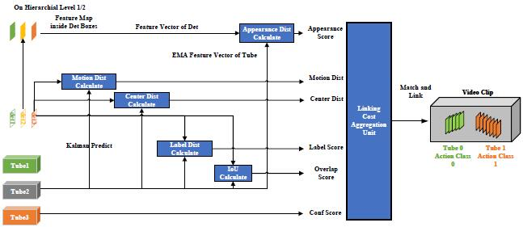

# MCHL
Project for Paper "Online Hierarchical Linking of Action Tubes for Spatio-Temporal Action Detection Based on Multiple Clues"

## Overview of MCHL


## MCHL Code Location
.evaluator/link_method.py

## Results
Frame-level results are obtained by YOWOv2 in UCF24 and MultiSports.
Video-level results are obtained by the MCHL method.

Frame-level detections and Video-level detections linked by the method can be download in the following link: 
https://pan.baidu.com/s/1l-oGwbAtKVfFaS-8OuFkFg 

access code: iehv 

## Build YOWOv2 Project
- We recommend you to use Anaconda to create a conda environment:
```Shell
conda create -n yowo python=3.6
```

- Then, activate the environment:
```Shell
conda activate yowo
```
- Requirements:
```Shell
pip install -r requirements.txt 
```

## Dataset

## UCF101-24:
You can download **UCF24** from the following links:

* Google drive

Link: https://drive.google.com/file/d/1Dwh90pRi7uGkH5qLRjQIFiEmMJrAog5J/view?usp=sharing

* BaiduYun Disk

Link: https://pan.baidu.com/s/11GZvbV0oAzBhNDVKXsVGKg

Password: hmu6 

##  Test MCHL
* Video mAP：

```Shell
python eval.py --cuda -d ucf24 --data_root /data1/su/datasets/UCF24-YOWO/ -tbs 16 -v yowo_v2_large --weight weights/ucf24/yowo_v2_large/yowo_v2_large_epoch_0.pth -ct 0.05 --cal_video_mAP --link_method mchl
```

